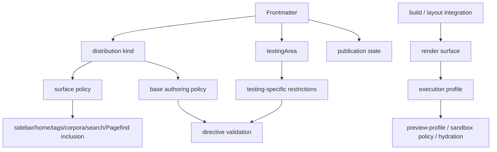

# ノート責務分離再設計仕様書（Rouault）

- 文書種別: 提案仕様
- 対象リポジトリ: `rouault.zip` 内の現行実装
- 作成日: 2026-03-30
- 設計方針: 長期保守性優先・互換性非優先
- 対象範囲:
  - note metadata
  - note surface policy
  - Markdown authoring / output / safety との統合
  - `code-preview` / `preview-sandbox` の実行文脈
  - `content/testing/**` と Storybook の責務境界
  - search / home / corpora / Pagefind への公開面制御

---

## 0. 要約

本仕様は、Rouault におけるノート責務分離を、**現行の `kind: reader | testing | demo` を前提とした運用から、複数軸の明示的モデルへ再整理**するための新設計書です。

現行実装では、すでに次が導入されています。

- note metadata に `kind: reader | testing | demo`
- `testingArea`
- `note-surface-policy`
- `validateNoteMetadataContracts(...)`
- `validateNoteContentContracts(...)`
- `injectNoteContentProfiles(...)`
- `content/testing/**` の分割
- `examples/**` + `::example-include`
- search / home / corpora / Pagefind からの `testing` 既定除外

これらは、責務分離の方向として概ね妥当です。  
特に、`testing` note の分離、build-time validation、shared example source、reader-facing surface からの `testing` 除外は、すでに良い基礎になっています。

一方で、現行実装には次の構造的な曖昧さが残っています。

- `demo` は型・surface policy・文書契約には存在するが、実運用上は休眠的な分類になっている
- preview profile の注入が `kind` に強く依存している
- metadata に将来的な異種概念を押し込みやすい構造圧が残っている
- Storybook と note system は実行経路としてはかなり分離されているが、`demo` の概念上の ownership はなお曖昧である

したがって本仕様では、次を正規モデルとして採用します。

1. **distribution kind**
   - `reader`
   - `testing`

2. **testing area**
   - `index`
   - `markdown-basic`
   - `media`
   - `code`
   - `interactive`
   - `sandbox`

3. **render surface**
   - `reader-note`
   - `testing-note`
   - `storybook`
   - `playground`（将来用。現時点では任意）

4. **execution profile**
   - `static`
   - `demo`
   - `sandbox`

5. **publication state**
   - `draft`
   - `published`
   - `archived`（将来用）

本仕様の核心は、**「何のコンテンツか」と「どこでどう表示・実行するか」を分離すること**です。  
これにより、読書用 note の静けさを維持しつつ、testing note と Storybook の検証能力・実演能力を、より明確な責務境界のもとで扱えるようにします。

---

## 1. 背景と問題設定

Rouault は「没入して読む」ことを主目的とする note アプリケーションです。  
この前提では、読者向け note の責務は次に限られるべきです。

- 読めること
- 探せること
- 路線図としてナビゲーションできること
- build-time で意味論が固定されていること

一方、Markdown 契約や UI 契約の検証には、読者向け note とは異なる性質のページが必要です。

- 変換結果の fixture を確認するページ
- interactive UI の状態遷移を確認するページ
- sandbox 実行を伴う preview を確認するページ
- isolated component demo を提示する Storybook

現行 repo は、重い総合試験ページを分割し、`content/testing/**` と `examples/**` を導入することで、この方向へすでに進んでいます。  
また、`testingArea`、surface policy、metadata validation も導入されており、最低限の責務整理は始まっています。

ただし、現行の分類モデルにはなお解釈上の揺れがあります。

- `reader` は読者向け配布物として安定運用されている
- `testing` は検証用 note として実運用されている
- `demo` は型と文書には存在するが、実運用上は休眠的であり、展示面・実行面を想起させる意味合いが強い

このため、`reader` / `testing` / `demo` を同一軸の `kind` として並べ続けると、次の境界が曖昧になりやすいです。

- 配布分類
- 公開面
- preview の実行性
- Storybook / playground の ownership

本仕様は、この曖昧さを解消するために、**distribution kind・render surface・execution profile を分離した明示的なモデル**へ再設計することを目的とします。

---

## 2. 現行実装の観察結果

### 2.1 すでに妥当な方向へ入っている実装

現行 repo には、責務分離の基礎として残すべき実装が存在します。

#### 2.1.1 metadata と build-time validation

- `src/types/note-kind.ts`
  - `reader | testing | demo`
- `src/types/testing-area.ts`
  - `index | markdown-basic | media | code | interactive | sandbox`
- `lib/content/note-metadata-contracts.ts`
  - `testing` では `testingArea` 必須
  - `testing` 以外では `testingArea` 禁止
- `velite.config.ts`
  - kind / testingArea の正規化と build-time validation

これは「metadata を build-time 契約として扱う」方向として正しいです。

#### 2.1.2 surface policy

- `src/types/note-surface-policy.ts`
  - `reader` は sidebar / breadcrumb / search / home / tags / corpora / pagefind を有効
  - `testing` は breadcrumb 以外を既定抑制
  - `demo` はすべて既定抑制

- `src/data/notes.ts`
  - `filterNotesBySurface(...)`
- `src/data/projections/home-page-projection.ts`
- `src/data/projections/corpus-page-projection.ts`
- `src/lib/search/build/build-search-catalog.ts`

これは「公開面 policy を note から導出する」方向として正しいです。

#### 2.1.3 testing note の分割

`content/testing/**` はすでに次へ分割されています。

- `index.md`
- `markdown-basic.md`
- `media.md`
- `code.md`
- `interactive.md`
- `sandbox.md`

これは総合試験ページを廃止し、壊れ方を切り分けやすくするうえで正しいです。

#### 2.1.4 shared example source

- `examples/manifests/testing-examples.ts`
- `lib/remark/expand-example-includes.ts`
- `examples/snippets/**`
- `examples/media/**`

note と Storybook が shared example source を共有できる方向は維持すべきです。

#### 2.1.5 preview policy

- `lib/remark/directives/policy/note-policy-context.ts`
- `lib/remark/directives/policy/preview-policy.ts`
- `lib/remark/directives/policy/sandbox-policy.ts`
- `lib/content/note-content-contracts.ts`

`reader` で `preview-sandbox` と `allow-js="true"` を禁止し、`testing/sandbox` のみ許可するのは妥当です。

---

### 2.2 現行実装の問題

#### 2.2.1 `demo` が `kind` に含まれているが、運用上は休眠的な分類になっている

`demo` は現行実装で enum として定義され、surface policy 上も分岐を持っています。  
したがって、型・build・projection の一般経路としては受理可能です。

一方で、現行 repo では `demo` note の正規配置、継続的に運用されている実ノート群、専用の authoring 導線は確認しづらく、実際の運用は `reader` と `testing` を中心に構成されています。  
そのため、`demo` は**壊れている分類**というより、**実装には残っているが実運用では休眠的な分類**になっています。

この状態自体は直ちに不整合ではありませんが、`demo` が次の性質を同時に想起させるため、設計軸を曖昧にしやすいです。

- Storybook 上での展示
- controls / toolbar / live preview の許可
- reader-facing な公開面からの除外
- preview の実演的な振る舞い

これらは「note の配布分類」というより、**render surface** や **execution profile** に近い概念です。  
そのため、長期的には `demo` を `kind` に残すより、distribution kind と別軸へ分離した方が解釈が安定します。

#### 2.2.2 `injectNoteContentProfiles(...)` では preview profile の注入が `kind` に強く依存している

現行 `injectNoteContentProfiles(...)` は、`reader` に対して `preview-profile="reader"` を与え、`reader` 以外には一律で `preview-profile="demo"` を与えます。

このため、preview UI の profile 注入という観点では、次の区別が表現されていません。

- `testing` と `demo` の差
- `testingArea=interactive` と `testingArea=sandbox` の差
- distribution kind と execution profile の差

ただし、sandbox の実行許可そのものは別途 policy context と directive validation でも制御されています。  
したがって現状は、**permission は部分的に分離されている一方、profile 注入は `kind` に強く引きずられている**状態です。

この構造だと、将来次のような微分化を入れにくくなります。

- `reader` note では静的 preview だけを許可する
- `testing` の中でも area により controls 可否を分ける
- Storybook と testing note で同じ `demo` profile を使いつつ permission だけ変える

長期保守性の観点では、preview profile は `kind` から直接決めるのではなく、より明示的な render / execution 文脈から導出した方がよいです。

#### 2.2.3 metadata には将来的に異種概念を押し込みやすい構造圧が残っている

現行文書と実装には、すでに次の抑制が入っています。

- `kind` を無制限な拡張点として扱わない
- `testingArea` は補助ラベルである
- `testingArea` は `kind: testing` のときのみ許可する

したがって、現時点で metadata 設計が破綻しているわけではありません。  
しかし、`demo` が `kind` に残っているため、`kind` が「配布分類」であると同時に「展示面」「実行面」「運用ラベル」も背負えるように見えやすくなっています。

このまま進むと、将来次のような値を `kind` に追加したくなる圧力が生じます。

- `benchmark`
- `temporary`
- `migration`
- `playground`
- `tutorial`
- `interactive`

これは避けるべきです。  
問題は「今すぐ値が増殖していること」ではなく、**将来の拡張圧が `kind` に集中しやすい構造が残っていること**です。

#### 2.2.4 Storybook と note system は実装上かなり分離されているが、概念上の ownership はまだ曖昧である

現行実装では、Storybook は `src/**/*.stories.ts` を正規入力として持ち、shared example source も note metadata を経由せず直接参照しています。  
そのため、少なくとも実行経路としては、Storybook と note collection はある程度分離されています。

ただし、`demo` を note metadata の `kind` として保持し続けると、概念上は次の問いが残ります。

- demo を note collection が所有するのか
- Storybook が demo の正本なのか
- router / search / sidebar / corpora が demo という概念を知るべきか
- demo 専用 URL を note URL と同じ系に置くべきか

つまり、現状の問題は「Storybook が note metadata に強依存していること」ではなく、**`demo` という概念の所有者が note system なのか Storybook なのかが文脈によって揺れること**です。

長期保守性の観点では、note system は `reader` / `testing` を所有し、isolated component demo は Storybook または将来の playground surface が所有する、と明示した方が責務境界は安定します。

---

## 3. 設計目標

### 3.1 目的

1. 読者向け note の静けさを守る  
2. testing note の検証能力を維持する  
3. isolated component demo の ownership を Storybook 側へ寄せる  
4. build-time で公開面と許可機能を固定する  
5. metadata へ異種概念を混在させない  
6. `code-preview` / `preview-sandbox` の意味論を1つに保つ  
7. 例の source of truth を単一化する  

### 3.2 非目的

1. 既存 `kind: demo` との互換維持  
2. demo 用 note URL の温存  
3. すべての interactive UI を note から排除すること  
4. Storybook と note の完全同一 DOM を必須化すること  
5. ランタイム裁量での救済を増やすこと  

---

## 4. 設計原則

### 4.1 単一軸原則

1つの metadata フィールドは1つの設計軸だけを表さなければなりません。  
`kind` 1語に distribution / visibility / runtime / purpose を詰め込んではなりません。

### 4.2 distribution と execution の分離

- distribution kind は「どの corpus に属するか」
- execution profile は「どこまで live に動かすか」

として分離します。

### 4.3 Storybook ownership 明示

isolated component demo の正規配置は Storybook とし、note collection はそれを所有しません。

### 4.4 build-time rejection 優先

読者向け note に許されない機能は runtime fallback ではなく build error とします。

### 4.5 shared source 優先

testing note と Storybook は同じ example source を参照し、意味論の二重管理を避けます。

### 4.6 authoring grammar 不増殖

`code-preview` を `reader-code-preview` / `demo-code-preview` のように分裂させてはなりません。  
文法ではなく **render contract** 側で差を吸収します。

---

## 5. 新しい概念モデル

## 5.1 distribution kind

distribution kind は note collection に属する文書の**配布上の分類**です。

値域:

- `reader`
- `testing`

規則:

- `reader` は読者向け正規 note とする
- `testing` は Markdown / output / UI 契約の検証用 note とする
- `demo` を distribution kind に含めてはならない

---

## 5.2 testing area

`testingArea` は `testing` note の**検証主題**を表す補助ラベルです。

値域:

- `index`
- `markdown-basic`
- `media`
- `code`
- `interactive`
- `sandbox`

規則:

- `testingArea` は `kind: testing` のとき必須
- `testingArea` は surface policy の主分岐に使ってはならない
- `testingArea` は content kind の拡張手段ではない
- `testingArea` は authoring policy の追加制約にのみ用いてよい

---

## 5.3 render surface

render surface は**どこに表示されるか**を表します。

値域:

- `reader-note`
- `testing-note`
- `storybook`
- `playground`

規則:

- note collection から生成される HTML は `reader-note` または `testing-note`
- Storybook は `storybook`
- 将来の専用 playground が必要な場合のみ `playground` を導入してよい
- render surface は frontmatter で author が直接指定してはならない
- render surface は build / SSR / integration 層が所有する

---

## 5.4 execution profile

execution profile は preview / sandbox 系 UI の**実行レベル**を表します。

値域:

- `static`
- `demo`
- `sandbox`

規則:

- `static`
  - 読書向け
  - inert または軽量 DOM
  - controls / toolbar を持たない
  - hydrate を要しても progressive 程度に留める
- `demo`
  - 実演向け
  - controls / toolbar / viewport 切替を許可してよい
  - live preview を許可してよい
  - author JS 実行は必須ではない
- `sandbox`
  - iframe 実行
  - compiler-generated `srcdoc`
  - `allow-js="true"` を許可しうる
  - 最も強い trust boundary を必要とする

---

## 5.5 publication state

公開状態は distribution kind と別軸で扱います。

値域:

- `draft`
- `published`
- `archived`（将来）

規則:

- `draft` は surface から除外してよい
- 公開状態を kind に混ぜてはならない

---

## 6. 正規モデル

以下を正規モデルとします。



重要なのは、**frontmatter が render surface や execution profile を直接持たない**ことです。

---

## 7. 公開面規則

### 7.1 distribution kind ごとの既定 surface

| distribution kind | 直接 URL | sidebar | breadcrumb | search | home | tags | corpora | Pagefind |
| --- | --- | --- | --- | --- | --- | --- | --- | --- |
| `reader` | 許可 | 含む | 含む | 含む | 含む | 含む | 含む | 含む |
| `testing` | 許可 | 既定除外 | 含む | 既定除外 | 除外 | 除外 | 除外 | 除外 |

規則:

1. `testing` note は直接 URL を持ってよい
2. `testing` note は breadcrumb を持ってよい
3. `testing` note は corpus / tag / home / search の reader-facing 集合へ入れてはならない
4. `testingArea` によってこの表を追加分岐させてはならない

---

## 8. authoring / validation 規則

### 8.1 reader

`reader` note は次を原則とします。

- `preview-sandbox` 禁止
- `allow-js="true"` 禁止
- `code-preview controls` 禁止
- `toolbar slot` 禁止
- 読書上不要な heavy UI を標準経路にしてはならない

### 8.2 testing

`testing` note は検証目的に必要な UI を許可します。  
ただし許可は `testingArea` によりさらに絞り込みます。

#### `testingArea=markdown-basic`
- 基本 Markdown 出力のみ
- sandbox 禁止
- heavy preview 禁止

#### `testingArea=media`
- image / figure / link-card
- sandbox 禁止

#### `testingArea=code`
- code block / code group
- sandbox 禁止

#### `testingArea=interactive`
- tabs / translation / details / info-box
- sandbox 禁止
- `allow-js="true"` 禁止

#### `testingArea=sandbox`
- `code-preview`
- `preview-sandbox`
- `allow-js="true"` 許可
- trusted demo / compiler-generated `srcdoc` を前提

---

## 9. `demo` の扱い

### 9.1 結論

新設計では、`demo` を note metadata の `kind` から外します。  
これは「現行の `demo` 実装が破綻しているから」ではなく、**現行運用の重心と概念上の責務境界に合わせて分類軸を整理するため**です。

### 9.2 理由

1. 現行実装では `demo` は型・surface policy・文書契約には存在する一方、実ノート群や正規運用導線では中心的に使われていないから  
2. `demo` は配布分類というより、render surface / execution profile / 展示文脈を想起させる概念だから  
3. Storybook はすでに shared example source を直接参照しており、実行経路としては note metadata に依存していないから  
4. `demo` を `kind` に残すと、「demo の所有者は note system か Storybook か」という概念上の ownership が曖昧なまま残るから  
5. `injectNoteContentProfiles(...)` では `reader` 以外が一律 `demo` profile へ寄せられており、distribution kind と preview 実行文脈が強く結び付いたままになるから

### 9.3 設計上の位置付け

本仕様において `demo` は、note の第一級分類ではなく、**実演面・展示面・実行文脈を表す側の語彙**として扱います。  
すなわち、`demo` は distribution kind ではなく、主として execution profile または Storybook / playground 側の surface 文脈で扱うことを想定します。

### 9.4 正規配置

- 読者向け・検証用の note: `content/**`
- isolated component demo: `src/**/*.stories.ts`
- shared example source: `examples/**`
- 必要なら将来 `playground/**` を別系統として導入してよい
- Storybook / playground の実演資産は `notes` collection に入れない

### 9.5 非互換変更としての扱い

`kind: demo` の除去は、現行型定義と文書契約に対する**意図的な非互換変更**です。  
ただし、現行 repo では `demo` が運用の中心ではないため、この非互換変更は既存の reader/testing 運用を大きく崩さずに導入できる可能性が高いと判断します。

---

## 10. `code-preview` / `preview-sandbox` 再設計規則

### 10.1 `code-preview`

`code-preview` は authoring 上 1 つの意味論に維持します。

規則:

- 別 directive 名を増やさない
- build / layout 側が render surface から execution profile を選ぶ
- `preview-profile` は internal attribute とし、frontmatter や directive から直接指定させない

### 10.2 profile 導出規則

| render surface | testingArea | execution profile | `preview-profile` |
| --- | --- | --- | --- |
| `reader-note` | - | `static` | `reader` |
| `testing-note` | `markdown-basic` / `media` / `code` / `interactive` | `demo` | `demo` |
| `testing-note` | `sandbox` | `sandbox` | `demo` + sandbox 許可 |
| `storybook` | - | `demo` or `sandbox` | `demo` |
| `playground` | - | `sandbox` | `demo` |

注記:
- 現行 `ui-code-preview` は `preview-profile: reader | demo` の2値なので、`sandbox` は profile 値ではなく **別 policy** として扱う
- 将来 profile を3値に広げる必要が出るまでは、`sandbox` は `demo + sandbox permission` の組み合わせで表現してよい

### 10.3 `preview-sandbox`

`preview-sandbox` は distribution kind ではなく **execution permission** で制御します。

規則:

- `reader-note` では禁止
- `testing-note` では `testingArea=sandbox` のみ許可
- `storybook` では許可してよい
- `allow-js="true"` は `sandbox` execution permission がある surface でのみ許可

---

## 11. ディレクトリ構成

本仕様で正規とする配置は次のとおりです。

```text
content/
  computer-science/
  music/
  program/
  testing/
    index.md
    markdown-basic.md
    media.md
    code.md
    interactive.md
    sandbox.md
  _assets/
    ...

examples/
  manifests/
    testing-examples.ts
  snippets/
    markdown-basic/
    media/
    code/
    interactive/
    sandbox/
  media/
    ...

src/
  stories/
    ...

lib/
  content/
  remark/
  rehype/
```

規則:

1. `content/testing/**` は `testing` 専用とする
2. 通常 note は `kind: reader` を既定とする
3. Storybook demo は `content/**` に置かない
4. `examples/**` を single source of truth とする
5. sandbox 例は `examples/snippets/sandbox/**` に集約する

---

## 12. ソースオブトゥルース

### 12.1 frontmatter 契約

- `docs/markdown/markdown-authoring-specification.md`
- `velite.config.ts`
- `lib/content/note-metadata-contracts.ts`

### 12.2 content validation 契約

- `lib/content/note-content-contracts.ts`
- `lib/remark/directives/policy/**`

### 12.3 surface policy 契約

- `src/types/note-surface-policy.ts`
- `src/data/notes.ts`
- 各 projection / build 系

### 12.4 preview 実行契約

- `docs/design-system/components/code-preview.md`
- `docs/design-system/components/preview-sandbox.md`
- `lib/content/note-content-contracts.ts`
- `src/components/ui/code-preview/code-preview.ts`

### 12.5 shared example 契約

- `examples/manifests/testing-examples.ts`
- `lib/remark/expand-example-includes.ts`
- Storybook story 側参照

---

## 13. 現行実装からの変更点

## 13.1 metadata

### 現行
- `kind: reader | testing | demo`

### 新設計
- `kind: reader | testing`

### 変更理由
- `demo` は現行実装で受理可能な kind ではあるが、実運用上は休眠的であり、配布分類より展示面・実行面の意味合いが強いため
- distribution kind を `reader/testing` に絞り、`demo` は surface / execution 側の語彙へ移すため

---

## 13.2 note policy context

### 現行
`createNotePolicyContext(kind, testingArea)` が、distribution kind を基点に authoring policy と実行許可の一部をまとめて扱っている

### 新設計
`createRenderPolicyContext({ distributionKind, testingArea, renderSurface })`

### 責務
- distribution kind から base authoring policy を決める
- testingArea から testing-specific restriction を決める
- render surface から execution permission を決める

### 変更理由
現行実装でも sandbox 許可は testingArea を見ており、完全に 1 軸へ潰れているわけではありません。  
しかし、preview profile 注入と許可判定の責務が異なる場所で異なる粒度で扱われており、設計上の読み取りが難しくなっています。  
そのため、新設計では distribution / testing subject / render surface を明示的に分離します。

---

## 13.3 `injectNoteContentProfiles(...)`

### 現行
- `reader` には `preview-profile="reader"` を与える
- `reader` 以外には一律で `preview-profile="demo"` を与える

### 新設計
- `preview-profile` は `renderSurface` から導出する
- `testing/sandbox` は `demo profile + sandbox permission` として扱う
- Storybook は `demo profile`
- `reader` note は `reader profile`

### 変更理由
現行実装では、preview profile の注入が `kind` に強く依存しているため、次の差が表現しにくいです。

- `testing` と `demo` の差
- `testingArea=interactive` と `testingArea=sandbox` の差
- distribution kind と execution profile の差

このため、新設計では preview profile を distribution kind の直接関数ではなく、render surface / execution 文脈から導出するように改めます。

---

## 13.4 search / home / corpora / Pagefind

### 現行
- distribution kind ベースの surface filter がすでに存在する
- `testing` は reader-facing surface から既定除外されている
- `demo` に対する policy も定義上は存在する

### 新設計
- `reader/testing` の2値前提へ整理する
- `demo` を note collection 側の surface filter 対象から除去する
- note collection 側は `reader/testing` 以外を知らない

### 変更理由
現行の surface filtering 自体は妥当です。  
変更点は filtering の仕組みそのものではなく、**その入力語彙を distribution kind に限定すること**です。  
これにより、公開面制御は note system が、展示・実演は Storybook / playground が、それぞれ自分の責務だけを扱う構成になります。

---

## 14. 実装方針

## 14.1 削除・縮約

### A. `src/types/note-kind.ts`
- `demo` を削除
- `NOTE_CONTENT_KINDS = ['reader', 'testing']`

### B. `src/types/note-surface-policy.ts`
- `DEMO_POLICY` を削除
- `resolveNoteSurfacePolicy(...)` を2値へ整理

### C. `test/ssr/notes-data.test.ts`
- `demo` 除外に関するテストを `reader/testing` 2値前提へ更新

---

## 14.2 新設

### A. `src/types/render-surface.ts`
```ts
export const RENDER_SURFACES = [
  'reader-note',
  'testing-note',
  'storybook',
  'playground',
] as const;
```

### B. `src/types/execution-profile.ts`
```ts
export const EXECUTION_PROFILES = ['static', 'demo', 'sandbox'] as const;
```

### C. `lib/content/render-policy-context.ts`
distribution kind / testingArea / renderSurface から統合 policy を導く正規モジュール

---

## 14.3 置換

### A. `lib/content/note-content-contracts.ts`
現行の `createNotePolicyContext(...)` 依存をやめ、`render-policy-context` を使う

### B. `src/data/projections/note-page-projection.ts`
`injectNoteContentProfiles(...)` へ `noteKind` ではなく render surface を渡す

### C. `NoteLayout.11ty.ts` / Storybook 側 integration
surface を内部的に明示し、preview policy を統一する

---

## 15. 改訂後の規範文

### 15.1 `kind`

`kind` は note の **distribution kind** であり、当該 note がどの公開面に属するか、ならびにどの base authoring policy を適用するかを決定する。  
`kind` は render surface、execution profile、purpose label、publication state を表してはならない。

値域:
- `reader`
- `testing`

規則:
- `reader` は読者向けの正規 note を表す
- `testing` は検証用 note を表す
- `demo` を `kind` の値として導入してはならない
- `kind` を展示用途・一時用途・作業段階ラベルの受け皿として用いてはならない

### 15.2 `testingArea`

`testingArea` は `testing` note の **検証主題を表す補助ラベル**である。  
`testingArea` は distribution kind の追加や公開面 policy の分岐に使ってはならない。

値域:
- `index`
- `markdown-basic`
- `media`
- `code`
- `interactive`
- `sandbox`

規則:
- `testingArea` は `kind: testing` のとき必須とする
- `kind !== testing` の note では `testingArea` を指定してはならない
- `testingArea` は testing note 内の追加制約や許可範囲の調整にのみ用いてよい
- `testingArea` を新たな content kind の代替として扱ってはならない

### 15.3 render surface

render surface は、対象コンテンツが **どこに表示されるか** を表す integration 上の内部概念である。  
render surface は author-facing metadata として frontmatter に露出してはならない。

値域:
- `reader-note`
- `testing-note`
- `storybook`
- `playground`

規則:
- note collection から生成される note page は `reader-note` または `testing-note` とする
- isolated component demo は `storybook` が所有する
- 将来 sandbox 中心の独立実演面が必要になった場合のみ `playground` を導入してよい
- render surface は build / SSR / integration 層が決定する

### 15.4 execution profile

execution profile は preview / sandbox 系 UI の **実行レベル** を表す integration policy であり、author-facing metadata に露出してはならない。

値域:
- `static`
- `demo`
- `sandbox`

規則:
- `static` は読書向けの静的または軽量な preview を表す
- `demo` は controls / toolbar / live preview を許容しうる実演向け profile を表す
- `sandbox` は iframe / `srcdoc` / author JS 許可を伴いうる強い実行 profile を表す
- execution profile は `kind` の直接関数として決めてはならず、render surface と policy context から導出しなければならない

### 15.5 `demo`

`demo` は note metadata の `kind` として導入してはならない。  
`demo` は distribution kind ではなく、主として execution profile または Storybook / playground 側の実演文脈で扱う語彙とする。

規則:
- isolated component demo の正規配置は Storybook とする
- Storybook / playground の実演資産を notes collection に入れてはならない
- note system は `reader` / `testing` のみを第一級分類として所有する

### 15.6 preview / sandbox policy

`code-preview` と `preview-sandbox` は directive 名を増殖させず、render surface と execution policy によって意味論を切り替える。

規則:
- `code-preview` は authoring grammar 上 1 つの directive として維持する
- `preview-profile` は internal attribute とし、frontmatter や directive 属性から直接指定させてはならない
- `reader-note` では `preview-sandbox` を禁止する
- `testing-note` では `testingArea=sandbox` のときのみ `preview-sandbox` と `allow-js="true"` を許可する
- `storybook` では必要に応じて `demo` または `sandbox` 相当の実行を許可してよい
- sandbox 許可は `preview-profile` とは別の permission として扱う

### 15.7 公開面規則

公開面制御は distribution kind に基づいて決定し、testingArea や demo 概念を主要分岐へ持ち込んではならない。

規則:
- `reader` note は sidebar / breadcrumb / search / home / tags / corpora / Pagefind に含めてよい
- `testing` note は直接 URL と breadcrumb を持ってよい
- `testing` note は reader-facing な sidebar / search / home / tags / corpora / Pagefind から除外しなければならない
- `testingArea` によって公開面規則を追加分岐させてはならない

### 15.8 publication state

公開状態は distribution kind と独立した軸として扱う。

値域:
- `draft`
- `published`
- `archived`

規則:
- publication state を `kind` に混在させてはならない
- `draft` の公開面露出可否は surface policy で制御してよい
- publication state は note の配布状態を表すものであり、実行 profile や testing area を代替してはならない

---

## 16. 受け入れ基準

### 16.1 metadata / build-time validation

1. `velite.config.ts` における `kind` の許容値が `reader | testing` のみになっている  
2. `kind: testing` の note では `testingArea` が必須である  
3. `kind !== testing` の note で `testingArea` を指定すると build error になる  
4. `kind: demo` を指定した note は build error になる  
5. publication state は `kind` と独立に定義され、`kind` の代替として使われていない  

### 16.2 surface policy / projections

6. `reader` note は sidebar / breadcrumb / search / home / tags / corpora / Pagefind に含まれる  
7. `testing` note は直接 URL を持ち、breadcrumb には含まれる  
8. `testing` note は reader-facing な sidebar / search / home / tags / corpora / Pagefind から除外される  
9. surface policy の主要分岐に `testingArea` が使われていない  
10. note collection / router / search core が `demo` を distribution kind として扱っていない  

### 16.3 render surface / execution profile

11. note page projection では `renderSurface` が内部的に明示され、`reader-note` と `testing-note` を区別できる  
12. Storybook 側は `storybook` surface として扱われ、note metadata を前提にせず shared example source を直接参照できる  
13. execution profile は `kind` の直接関数ではなく、`renderSurface` と policy context から導出される  
14. `preview-profile` の注入は `noteKind` 直結ではなく render / execution 文脈から決定される  
15. `testingArea=sandbox` は `demo profile + sandbox permission` またはそれと等価な形で表現され、単なる `testing` 一括扱いになっていない  

### 16.4 authoring / content contracts

16. `reader` note で `preview-sandbox` を使うと build error になる  
17. `reader` note で `allow-js="true"` を使うと build error になる  
18. `testing` note のうち `testingArea=sandbox` 以外では `allow-js="true"` を使うと build error になる  
19. `testingArea=markdown-basic` / `media` / `code` / `interactive` の各 area に対し、想定外の heavy preview / sandbox 利用が build-time に拒否される  
20. `code-preview` は authoring grammar 上 1 つの directive 名に維持され、reader 用・demo 用の別 directive へ分裂していない  

### 16.5 ownership / source of truth

21. Storybook の isolated component demo は `notes` collection に入っていない  
22. shared example source は `examples/**` を正本としており、note と Storybook の双方から参照できる  
23. `demo` は note metadata の第一級分類ではなく、Storybook / playground / execution profile 側の語彙としてのみ残っている  
24. note system の責務が `reader` / `testing` に限定され、demo の概念上の ownership が note collection から外れている  

### 16.6 回帰防止

25. metadata validation・surface filtering・note page projection・preview policy・Storybook example 参照について、それぞれ回帰テストが存在する  
26. `kind: demo` を再導入すると失敗するテストが存在する  
27. `reader` 以外を一律 `preview-profile="demo"` に注入する旧挙動へ戻すと失敗するテストが存在する  
28. `testing/sandbox` と `testing/interactive` の差が消えると失敗するテストが存在する  

---

## 17. 段階的移行計画

### フェーズ1: 型と文書の正規化
- `kind` を `reader | testing` に縮約
- `demo` を文書上 Storybook ownership へ移動
- `note-authoring-guide` と `markdown-authoring-specification` を改訂

### フェーズ2: policy context 再構成
- `render-policy-context` 導入
- `note-content-contracts.ts` を置換
- `injectNoteContentProfiles(...)` を surface ベース化

### フェーズ3: テスト再構成
- metadata / policy / projection / Storybook shared example のテストを再編
- `demo` 依存テストを削除
- render surface ごとの fixture を追加

### フェーズ4: 将来拡張
- 必要なら `playground` surface を追加
- ただし note metadata へ新 kind を追加しない

---

## 18. この設計で維持するもの / 捨てるもの

### 維持するもの
- `content/testing/**` の分割
- `testingArea`
- build-time validation
- shared example source
- `preview-sandbox` の strict policy
- search / home / corpora / Pagefind からの testing 除外

### 捨てるもの
- `kind: demo`
- note system が demo surface を所有する発想
- kind と preview profile の直結
- content kind と execution policy の混線

---

## 19. 最終判断

Rouault の長期保守性を優先するなら、**note の第一級分類は `reader` と `testing` に留めるべき**です。  
`demo` は note ではなく Storybook / playground の責務として切り離し、preview の実行性は render surface と execution profile で扱う方が、実装・仕様・文書・テストの全体整合がよくなります。

本仕様は、その再設計を正規構成として採用することを提案します。
